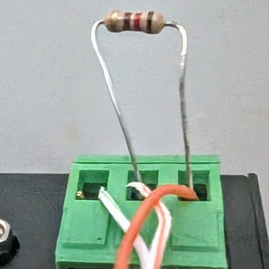
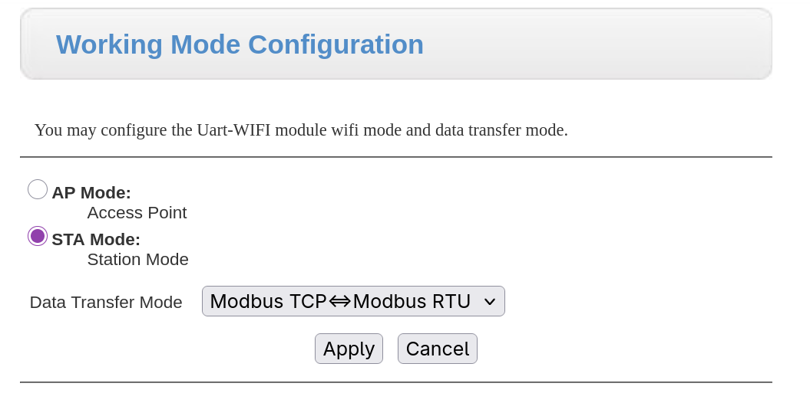

# Adaptors & Wiring

## RS485 wiring

RS485 requires a twisted pair, this works with CAT5 network cable and RJ-45 connectors.

If the RJ-45 connector on the inverter side is crimped according to [T568A/T568B](https://en.wikipedia.org/wiki/ANSI/TIA-568#Wiring), you can use the pinout in the following table. If the two outermost colors you see on the connector are brown and green, it is probably T568A; if they are brown and orange, it is probably T568B.

| RJ45 Pin (inverter side) | Wire Color (when using T568A) | Wire Color (when using T568B) | RS485 pins |
| :-------------------------: | :------------------------------: | :------------------------------: | :-----------: |
|              1              |           Green-White            |           Orange-White           |     B/D-      |
|              2              |              Green               |              Orange              |     A/D+      |
|              3              |           Orange-White           |           Green-White            |      GND      |

::: tip

The newer inverters have a combined RS485 and CAN-BUS port. If your battery is already using the port for its CAN-BUS communications, you need to split the cable to connect your RS485 connector. The following articles explains the wiring of the port:

- [DIY cable split](https://solarenergyconcepts.co.uk/practical-and-diy/crc-error-solar-assistant/)
- [SolarAssistant's RJ45 splitter](https://solar-assistant.io/help/deye/2_in_1_bms_port)

:::

## USB-to-RS485 adaptors

1. Waveshare USB-to-RS485 [example](https://www.robotics.org.za/W17286)

   This is my preferred adaptor. It includes a GND and lightning/ESD protection, TVS diodes and a resettable fuse.

   

   Waveshare also has a RS485-to-Ethernet module. (which does not work!)

2. USB-to-RS485 adaptor with cable [example](https://www.robotics.org.za/index.php?route=product/product&product_id=5947)

   Includes a GND and TVS diode and USB self recovery options.

   

Other tested adaptors

- USB-to-RS485 3 Pin adaptor [example](https://www.robotics.org.za/RS485-3P)

  Includes a GND and TVS diode and USB self recovery options.

- 2-Wire USB-to-RS485 [example](https://www.robotics.org.za/RS485-MINI)

  This is the adaptor I started with. It works, but does not include a GND, so your success might vary.
  

## Ethernet-to-RS485 gateways

1. USR-W630 Wifi-to-RS485

   This is a tested Wifi-to-RS485 gateway, which also includes a GND.

   Requires `READ_SENSORS_BATCH_SIZE` set to 8 or less

   A 120 Ohm (brown-red-brown) resistor may be required for data communication between the adapter and inveter to occur without corruption. The resistor should be added between the A+B lines, such as in the example below.

   > NOTE: The resistor legs should be trimmed to a more reasonable length to ensure they don't accidentally short together.

   

   #### USR-W630 Configuration (Wi-Fi)
   1. Connect the USR-W630 to your home network using the STA Interface Settings.
   2. Set Working Mode Configuration to `Modbus TCP<=>Modbus RTU`:
   
   2. Ensure "Modbus Polling" is disabled:
   
   3. Configure the TCP server for the add-on to connect to:
   
      - This port is used in the addon configuration when adding the inverter connection.
      - The server address of the USR-W630 is determined when the network connection was established, the greyed out value here is irrelevant.

2. USR-W610 Wifi-to-RS485

   This is a tested Wifi-to-RS485 gateway. Usually significantly cheaper than the W630, however it does not include a GND.

   Requires `READ_SENSORS_BATCH_SIZE` set to 8 or less

3. HF5142B  Modbus/serial to ethernet (4x RS232/485/422 to 4x E-Ports)

   

   This gateway was tested with the Deye 8k EU Hybrid inverter. The following serial settings were used:

   

4. Waveshare RS485 TO (POE) ETH  (1x RS485 to 1x E-Port)

   

   This gateway was tested with the Deye 3 Phase Hybrid Inverter SUN-25K-SG01HP3-EU-AM2. The following serial settings were used:

   

## Sunsynk Inverters

### Sunsynk 3.6kW Inverter

### Sunsynk Ecco 3.6kW Hybrid Inverter

Model number: `SUN-3.6K-SG04LP1-EU`

This likely applies to similar models in the Ecco range: `SUN-3K-SG04LP1-24-EU / SUN-3K-SG04LP1-EU / SUN-5K-SG04LP1-EU / SUN-6K-SG04LP1-EU`

[Closer view of the RS485/CAN port](../images/inv-ss-ecco-3-6kw-485can.png)

### Sunsynk 5.5kW Inverter

Tested with: USB-to-RS485 adaptor sourced from Banggood, very similar to [this](https://www.robotics.org.za/RS485-MINI?search=rs485).

NOTE: RJ-45 port marked **RS485** (bottom right) does not work.

### Sunsynk 8.8kW Inverter

Tested with: USB-to-485 adaptor sourced from Micro Robotics, [here](https://www.robotics.org.za/index.php?route=product/product&product_id=5947)

## Deye Inverters

### Deye 8kW Inverter

RS485 is the blue line - top left, as with the Sunsynk inverters. Yellow is the CAN-comms with the Pylontech batteries

### Deye 25kW HV Inverter

RS485 is the grey line - bottom right. BMS1 is the CAN-comms with the Dyness batteries

## Turbo-Energy Inverter

### Turbo-Energy 5kW Inverter

Tested with: USB-to-RS485 adaptor sourced from Aliexpress, very similar to [this](https://www.robotics.org.za/RS485-3P).
